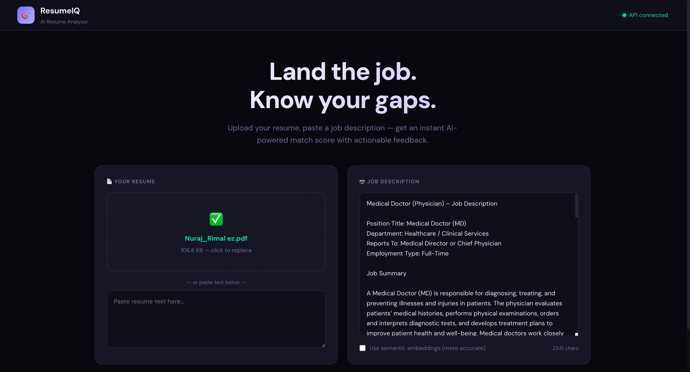
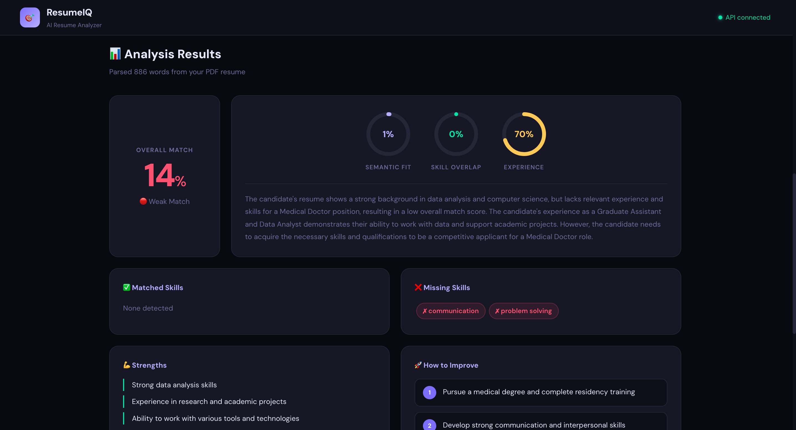
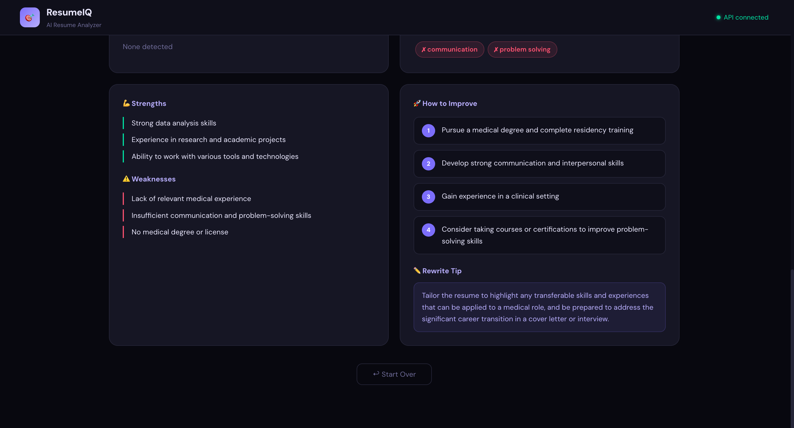

# 🎯 ResumeIQ — AI-Powered Resume Analyzer

A full-stack AI application that analyzes your resume against a job description and gives you an instant match score, skill gap breakdown, and personalized improvement suggestions powered by **LLaMA 3.3 (Groq) + FastAPI + React**.

> Built as a portfolio project demonstrating NLP, LLM integration, REST API design, and full-stack development.

---

## ✨ Features

- 📄 **Resume Parsing** — Upload PDF, DOCX, or TXT files
- 🔍 **Skill Extraction** — Detects 100+ technical and soft skills automatically
- 📊 **Match Score** — Weighted score combining semantic fit, skill overlap, and experience level
- 🤖 **AI Insights** — Strengths, weaknesses, and specific suggestions powered by LLaMA 3.3
- ⚛️ **React Frontend** — Clean, modern UI connected to FastAPI backend
- 🚀 **FastAPI Backend** — REST API with auto-generated Swagger docs at `/docs`

---
## 📸 Screenshots

### Home Screen


### Matched vs Missing Skills


### Match Score & Breakdown



## 🖥️ Demo

```
Upload Resume → Paste Job Description → Get Instant AI Feedback
```

**Results include:**
- Overall match score (0–100%)
- Semantic fit, skill overlap, experience scores
- Matched vs missing skills
- AI-generated strengths, weaknesses, suggestions
- Resume rewrite tip

---

## 🏗️ Project Structure

```
resumeiq-ai-analyzer/
│
├── app/                        # 🐍 Python Backend
│   ├── api.py                  # FastAPI server — REST endpoints
│   ├── main.py                 # Streamlit UI (alternative interface)
│   ├── resume_parser.py        # PDF / DOCX / TXT text extraction
│   ├── skill_extractor.py      # Skills dictionary + NLP matching
│   ├── similarity_engine.py    # Embeddings + TF-IDF similarity scoring
│   └── llm_analyzer.py         # Groq LLaMA API integration
│
├── frontend/                   # ⚛️ React Frontend
│   ├── src/
│   │   ├── App.jsx             # Main UI component
│   │   ├── api.js              # HTTP calls to FastAPI backend
│   │   ├── main.jsx            # React entry point
│   │   └── index.css           # Global styles
│   ├── index.html
│   ├── package.json
│   └── vite.config.js          # Proxies /api → localhost:8000
│
├── data/                       # Sample resumes (gitignored)
├── models/                     # Cached embedding models (gitignored)
├── .env.example                # ⚠️ Environment variables template — see below
├── .gitignore
├── requirements.txt
└── README.md
```

---

## ⚙️ Setup & Installation

### Prerequisites
- Python 3.10+
- Node.js 18+
- Free Groq API key → https://console.groq.com (no credit card required)

---

### 1. Clone the repository
```bash
git clone https://github.com/nurajrimal/resumeiq-ai-analyzer.git
cd resumeiq-ai-analyzer
```

### 2. Set up Python backend
```bash
# Create virtual environment
python3 -m venv venv
source venv/bin/activate        # Mac/Linux
venv\Scripts\activate           # Windows

# Install dependencies
pip install -r requirements.txt
```

### 3. Configure environment variables

```bash
cp .env.example .env
```

Open the `.env` file and add your own API key:
```
GROQ_API_KEY=your_own_groq_api_key_here
```

> 🔑 **Get your free Groq API key at:** https://console.groq.com
> - Sign up with Google
> - Click "API Keys" → "Create API Key"
> - No credit card required
> - Free tier: 14,400 requests/day

### 4. Set up React frontend
```bash
cd frontend
npm install
cd ..
```

---

## 🚀 Running the App

Open **two terminal windows:**

**Terminal 1 — Start the backend:**
```bash
source venv/bin/activate
uvicorn app.api:app --reload --port 8000
```

**Terminal 2 — Start the frontend:**
```bash
cd frontend
npm run dev
```

Then open **http://localhost:5173** in your browser ✅

---

## 🔌 API Reference

Interactive docs available at **http://localhost:8000/docs** when backend is running.

| Method | Endpoint | Description |
|--------|----------|-------------|
| GET | /health | Health check |
| POST | /analyze | Analyze resume vs job description |

**POST /analyze — Form fields:**
```
resume_file       File      PDF / DOCX / TXT upload (optional)
resume_text       string    Plain text resume (used if no file)
job_description   string    Job posting text (required)
use_embeddings    bool      Use sentence-transformers (default: false)
```

---

## 💡 How It Works

```
Resume Upload
      │
      ▼
Text Extraction        ← resume_parser.py
      │
      ▼
Skill Extraction       ← skill_extractor.py
      │
      ▼
Similarity Scoring     ← similarity_engine.py
  ├── Semantic (TF-IDF / embeddings)
  ├── Skill overlap
  └── Experience heuristic
      │
      ▼
LLaMA 3.3 Analysis     ← llm_analyzer.py (Groq API)
      │
      ▼
Match Score + Insights ← React UI (App.jsx)
```

---

## 🛠️ Technologies Used

| Layer | Technology |
|-------|-----------|
| AI/LLM | LLaMA 3.3 70B via Groq API (free) |
| Backend | FastAPI + Uvicorn |
| NLP | sentence-transformers, scikit-learn |
| Resume Parsing | pdfplumber, python-docx |
| Frontend | React 18 + Vite |
| Styling | Vanilla CSS with CSS variables |

---

## 🌐 Deployment

### Backend — Render / Railway
```bash
# Start command
uvicorn app.api:app --host 0.0.0.0 --port $PORT
```
Add `GROQ_API_KEY` in your platform's environment variables settings.

### Frontend — Vercel / Netlify
1. Update `BASE` in `frontend/src/api.js` to your deployed backend URL
2. Deploy the `frontend/` folder

---

## 🔮 Future Improvements

- [ ] LinkedIn profile URL input
- [ ] Downloadable PDF report
- [ ] Batch resume comparison
- [ ] ATS keyword optimization mode
- [ ] AI-powered resume rewrite

---

## 👤 Author

**Nuraj Rimal**
- GitHub: [@nurajrimal](https://github.com/nurajrimal)
